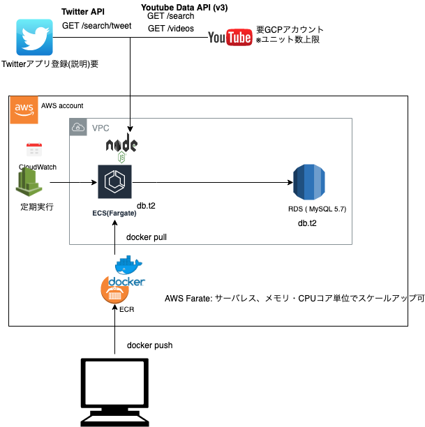

# README

## 使い方

```
export NODE_ENV="production"
export EGO_SEARCH_KEYWORD="洋楽"
export EGO_SEARCH_CHANNEL_ID="UCVuV4A4UfetQa_xsUv1K54w"
export EGO_SEARCH_USER_NAME="test"
export YOUTUBE_API_KEY="発行された値をセット"
export TWITTER_CONSUMER_KEY="発行された値をセット"
export TWITTER_CONSUMER_SECRET="発行された値をセット"
export TWITTER_ACCESS_TOKEN_KEY="発行された値をセット"
export TWITTER_ACCESS_TOKEN_SECRET="発行された値をセット"
export TYPEORM_CONNECTION="mysql"
export TYPEORM_HOST="localhost"
export TYPEORM_USERNAME="root"
export TYPEORM_PASSWORD="root"
export TYPEORM_DATABASE="test"
export TYPEORM_PORT=3306
yarn run start 
```


## 構成図



  * Youtube,Twitter,AWS ECS Fargate,Docker,Terraform,NodeJs

## Tables

* youtube_channels

```
youtube_user_name: text
channel_id: text
title: text
```

* search_history

```
key: varchar(255) -- egosearch_{channel_id}_yyyyMMddHHmmss
channel_id: text
created_at: timestamp
```

* youtube_videos

```
search_history_key: text
video_id: text
snippet_channel_id: text
snippet_title: text
snippet_description: text
snippet_published_at: text 
statistics_view_count: int
statistics_like_count: int
statistics_dislike_count: int
statistics_favorite_count: int
statistics_comment_count: int
context: text
```

* twitter_statuses

```
search_history_key: text,
q: text,
tweet_id_str: text,
tweet_text: text,
retweet_count: int,
favorite_count: int,
favorited: boolean,
retweeted: boolean,
tweet_text: text,
created_at: text,
user_followers_count: int,
user_friends_count: int,
user_favourites_count: int,
user_statuses_count: int,
user: JSON, 
entities: JSON, 
metadata: JSON,
geo: JSON,
possibly_sensitive: false,
tweet_id_str: text, // '1181175379903385600',
truncated: boolean,
source: text, = context.source; //: '<a href="https://peing.net" rel="nofollow">Peing</a>',
in_reply_to_status_id: text,
in_reply_to_status_id_str: text,
in_reply_to_user_id: text,
in_reply_to_user_id_str: text,
in_reply_to_screen_name: text,
coordinates: text, 
place: text,
contributors: text,
is_quote_status: text,
```


## 利用イメージ


```
# エゴサーチ

* 閲覧した記事

https://arata01.info/ego-search-twitter-6962
https://arata01.info/ego-search-google-6995
https://arata01.info/egosearch-appli-7254
https://r25.jp/article/626628014750116040

* 目的
  * どれくらい興味・関心があるか？を知っておくこと(人気や知名度の指標)
  * エゴサーチで自分に対する本音を探す. いい声も悪い声もどちらも欲しい(Good/Bad)
  * 過去に掲載している個人情報があったら、不利益がありそうなものは削除
  * 予期せず個人情報を掲載されている場合、必ず削除申請をしておくこと
    * タウンページなどの本には電話番号と名前がずらずら載っているので、転載すれば個人情報の嵐
  * もし誹謗中傷が人の目にさらされる状態で個人のブランドを傷つける場合は、しかるべき処置を取る

* 手段
  * Twitter
    * 基本
      * サイトURLで検索する Twitterの場合『https://』や『http://』を入れると検索できないので『arata01.info』と入力する / サイトに関わるツイートが表示され / すべてのつぶやきを閲覧したい場合は『すべてのツイート』をクリック
      * 記事タイトルで検索する ブログ記事のタイトルを入れて検索する方法
      * 本名で検索する方法 微妙に検索結果が変わる 大島松二郎 vs 大島 松二郎
      * Twitterドメインで検索する（自分以外のエゴサを表示させる） 注意※Twitterドメインでエゴサする際は「自分以外」を表示させる arata0_100-from:arata0_100 ( -from は自分のアカウントのつぶやきを除外 )
      * ハンドルネームで検索する
    * ツール
      * 流ツイ
        * 特定のキーワードに関するタイムラインが見れる
        * ツイッターアカウントでログインして、流ツイに権限が移譲される。すると、ハッシュタグがついてないツイートも検索できるようになる
      * Yahoo!検索（リアルタイム）
        * ヤフーのリアルタイム検索は過去１ヶ月間の投稿しか保存されません
      * エゴサッター  2017-10-12 2018-03-16 (個人的にはエゴサッターをよりも、普通にTwitterでエゴサーチした方が良いように思いました)
        * https://arata01.info/egosearch-appli-7254
        * 指定した検索ワードで自分に対するつぶやきを一括で探す
            * 検索ワード
            * 多くなるほど遅くなる
            * MAX10件程度
            * 除外ユーザ
            * また検索にヒットさせたくないユーザーやワードがある場合
            * フォロー中のユーザ・ツイートだけ検索する
            * 検索API制限 / 検索API制限回復時刻
            * RSS配信
      * Twitterの検索コマンドを駆使する
        * https://r25.jp/article/626628014750116040
  * インスタグラムのエゴサーチの検索
    * 自分の名前（店舗は店名）のハッシュタグ検索


## OUTPUT ??

* メンター
  * Yahoo!検索（リアルタイム）
* メンター + 1改善
* 特徴
  * 終わりがない
  * 継続して変化を追い続けることが必要。経営者や個人事業主が行うので時間がない中でのエゴサーチ
  * 基準は人それぞれだけど、有名な人や反響の多いフィードバックは知っておきたい。
  * エゴウォッチする

* リスク
  * エゴサーチをしたことがバレる可能性があるとしたら??
    * 以下のような行動をしたときだけです。
      * いいね
      * コメント
      * DMの閲覧
      * フォローする
      * 自分のアカウントで履歴を見られる
      * ストーリーの閲覧

* 実績 -> 類似する機能の開発案件 -> 収益化
* 実績 -> 広告から収益化
* 継続性があり、収益につながるスキル
  * スクレイピングしてデータを蓄積
  * 簡単に視える化をする
    * Redash提案
    * 独自のグラフ化
```

## ローカルテスト

```bash
sh test/local-script.sh
$ yarn run start 
yarn run v1.16.0
$ node dist/index.js
[ { id: { videoId: 'ipOr1DXYdtk' } },
  { id: { videoId: 'WCGDYy9lyoQ' } },
  { id: { videoId: 'RCxYlWWVrXg' } },
  { id: { videoId: 'gUBjIzwb8Qg' } },
  { id: { videoId: 'H-TNoIMYbLc' } },
  { id: { videoId: 's7Gzf2cH5gY' } },
  { id: { videoId: 'vkDDkSQ1Fa8' } },
  { id: { videoId: 'lcZGGhNgH8o' } },
  { id: { videoId: 'PNn7OyPnDbY' } },
  { id: { videoId: 'eCp2YNnKSg8' } } ]
videoidsCsv
ipOr1DXYdtk,WCGDYy9lyoQ,RCxYlWWVrXg,gUBjIzwb8Qg,H-TNoIMYbLc,s7Gzf2cH5gY,vkDDkSQ1Fa8,lcZGGhNgH8o,PNn7OyPnDbY,eCp2YNnKSg8
videos search by ids
[ { kind: 'youtube#video',
    etag: '"p4VTdlkQv3HQeTEaXgvLePAydmU/y-R9DB5ZpvJFvRX1HrgBd09R1EE"',
    id: 'ipOr1DXYdtk',
    snippet: 
     { publishedAt: '2019-09-22T12:44:12.000Z',
       channelId: 'UC4uQGT9lneEY1X7UO0i7-Zw',
       title: 'ドラゴンボール超 ブロリー［MAD］',
       description: 'ドラゴンボール超 ブロリーのMADです。公式ではありません。',
       thumbnails: [Object],
       channelTitle: '東京都の帝王アイース',
       tags: [Array],
       categoryId: '22',
       liveBroadcastContent: 'none',
       localized: [Object] },
    contentDetails: 
     { duration: 'PT4M12S',
       dimension: '2d',
       definition: 'hd',
       caption: 'false',
       licensedContent: false,
       projection: 'rectangular' },
    statistics: 
     { viewCount: '1',
       likeCount: '1',
       dislikeCount: '0',
       favoriteCount: '0',
       commentCount: '0' } },
  { kind: 'youtube#video',
    etag: '"p4VTdlkQv3HQeTEaXgvLePAydmU/0JlUPXsDTpOJYKi8UuA13cl8IrI"',
    id: 'WCGDYy9lyoQ',
    snippet: 
     { publishedAt: '2019-09-22T12:00:08.000Z',
       channelId: 'UC9nf6xm86marK6N1hh87bQQ',
       title: 'ドラゴンボールGT【HD】悟空 vs 鉄猫 || Dragon Ball GT #2',
       description: 'ドラゴンボールGT【HD】悟空 vs 鉄猫 || Dragon Ball GT #2\nドラゴンボールGT【HD】悟空 vs 鉄猫 || Dragon Ball GT #2\nドラゴンボールGT【HD】悟空 vs 鉄猫 || Dragon Ball GT #2',
       thumbnails: [Object],
       channelTitle: 'Kamehameha',
       tags: [Array],
       categoryId: '1',
       liveBroadcastContent: 'none',
       localized: [Object] },
    contentDetails: 
     { duration: 'PT10M32S',
       dimension: '2d',
       definition: 'hd',
       caption: 'false',
       licensedContent: false,
       projection: 'rectangular' },
    statistics: 
     { viewCount: '8',
       likeCount: '1',
       dislikeCount: '0',
       favoriteCount: '0',
       commentCount: '0' } },
  { kind: 'youtube#video',
    etag: '"p4VTdlkQv3HQeTEaXgvLePAydmU/8M3PzUHLzt_4BUzyRkOx2XtxSz4"',
    id: 'RCxYlWWVrXg',
    snippet: 
     { publishedAt: '2019-09-22T11:28:49.000Z',
       channelId: 'UCSFfqy26dEqSKAu-D7LEZqw',
       title: 'ドラゴンボールファイターズ　サクマ ps4版',
       description: 'Xboxoneにてドラゴンボールファイターズをやっています。\nサークルマッチやパーティーマッチなどの様子を配信いたします。\nXboxでやっているという方は是非コメントをしていただき、クラブに参加してほしいと考えておりますので、よろしくお願いします。',
       thumbnails: [Object],
       channelTitle: 'DBFZクラブ活動記録',
       tags: [Array],
       categoryId: '20',
       liveBroadcastContent: 'live',
       defaultLanguage: 'ja',
       localized: [Object],
       defaultAudioLanguage: 'ja' },
    contentDetails: 
     { duration: 'PT0S',
       dimension: '2d',
       definition: 'sd',
       caption: 'false',
       licensedContent: false,
       projection: 'rectangular' },
    statistics: 
     { viewCount: '10',
       likeCount: '0',
       dislikeCount: '0',
       favoriteCount: '0',
       commentCount: '0' } },
  { kind: 'youtube#video',
    etag: '"p4VTdlkQv3HQeTEaXgvLePAydmU/PDjgSeUKo5hvIEwKJCxBTIy91Yc"',
    id: 'gUBjIzwb8Qg',
    snippet: 
     { publishedAt: '2019-09-22T11:00:34.000Z',
       channelId: 'UCoL330jAuLJHbSFb1araHwA',
       title: '超サイヤ人カテゴリでドラゴンヒストリー挑んでみた\nドラゴンボールドッカンバトル',
       description: 'サブチャンネル作りました⬇️\nhttps://www.youtube.com/channel/UCpRYRX_Suh-OA_wlD4VB-zQ\nーーーーーーーーーーーーーーーーーーー\nチャンネル登録お願いします⬇️\nhttps://www.youtube.com/channel/UCoL330jAuLJHbSFb1araHwA?sub_confirmation\nーーーーーーーーーーーーーーーーーーー\nTwitterのフォロー良ければお願いします https://twitter.com/0iuEKupCmRbUevm?s=09\nーーーーーーーーーーーーーーーーーーー主にドラゴンボールなどのゲームの動画を投稿します\nアンチコメントはブロックの対象になります\n動画の転載はOKです\nーーーーーーーーーーーーーーーーーーー\nドッカン フレンドID\n1865361901\nスイッチフレンドコード\nSW510306265237\n申請送るときはコメントください',
       thumbnails: [Object],
       channelTitle: 'げむじい',
       categoryId: '20',
       liveBroadcastContent: 'none',
       localized: [Object] },
    contentDetails: 
     { duration: 'PT20M53S',
       dimension: '2d',
       definition: 'hd',
       caption: 'false',
       licensedContent: false,
       projection: 'rectangular' },
    statistics: 
     { viewCount: '8',
       likeCount: '0',
       dislikeCount: '0',
       favoriteCount: '0',
       commentCount: '0' } },
  { kind: 'youtube#video',
    etag: '"p4VTdlkQv3HQeTEaXgvLePAydmU/317E3uHVDVaSUecFx2xi-UakXio"',
    id: 'H-TNoIMYbLc',
    snippet: 
     { publishedAt: '2019-09-22T10:52:09.000Z',
       channelId: 'UCx55fcj3rjvVc5QU6J0lHFA',
       title: 'ドラゴンボールファイターズ　ランクマ，サクマ',
       description: 'PS4のシェア機能・ブロードキャストを使ってゲームのプレイ、実況動画を上げていこうと思います。過去動画は再生リストから良かったら見てね(^-^)/\nゲームで一緒に遊んだ場合、ご自身のチャンネルで配信してもらって問題ありません！むしろして(笑)\n一緒にゲームを盛り上げましょう！\nバンバン絡んでね！\n\n[twitter]https://twitter.com/igemeron　　 [pixiv]http://pixiv.me/igemodo-07',
       thumbnails: [Object],
       channelTitle: '池卓',
       tags: [Array],
       categoryId: '20',
       liveBroadcastContent: 'live',
       defaultLanguage: 'ja',
       localized: [Object],
       defaultAudioLanguage: 'ja' },
    contentDetails: 
     { duration: 'PT0S',
       dimension: '2d',
       definition: 'sd',
       caption: 'false',
       licensedContent: false,
       projection: 'rectangular' },
    statistics: 
     { viewCount: '56',
       likeCount: '0',
       dislikeCount: '0',
       favoriteCount: '0',
       commentCount: '0' } },
  { kind: 'youtube#video',
    etag: '"p4VTdlkQv3HQeTEaXgvLePAydmU/_JBWBaoX5vTHy7KfyVtjpfLsIgY"',
    id: 's7Gzf2cH5gY',
    snippet: 
     { publishedAt: '2019-09-22T10:41:14.000Z',
       channelId: 'UC5_CpXSpIJcr3YKbdK04wUA',
       title: '暴君のドラゴンボールファイターズ配信　やさいぃやさいぃやさいぃぃぃ！！！',
       description: '良かったらチャンネル登録高評価お願いします！      please subscribe\n基本的にドラゴンボールファイターズ、ＲＥＡＬＭ　ＲＯＹＡＬＥをメインにやってます！\n対戦相手募集、参加ＯＫです！気軽に声かけてください\n暴言めちゃくちゃ吐くけど悪気はありません笑　　対戦終わればノーサイド！\n\nTwitterアカウントhttps://twitter.com/yuseiyuseihae\nよかったらフォローの方もよろしくおねがいします！\n\n#ゴボ　＃１０先　＃サクマ　＃ＤＢＦＺ  #ドラゴンボールファイターズ　＃格ゲー　＃ランクマ　＃ドラゴンボール　＃ブロリー　＃参加　#Dragonball',
       thumbnails: [Object],
       channelTitle: 'ゆせおじチャンネル',
       tags: [Array],
       categoryId: '20',
       liveBroadcastContent: 'none',
       defaultLanguage: 'ja',
       localized: [Object],
       defaultAudioLanguage: 'ja' },
    contentDetails: 
     { duration: 'PT24M50S',
       dimension: '2d',
       definition: 'hd',
       caption: 'false',
       licensedContent: false,
       projection: 'rectangular' },
    statistics: 
     { viewCount: '103',
       likeCount: '2',
       dislikeCount: '1',
       favoriteCount: '0',
       commentCount: '0' } },
  { kind: 'youtube#video',
    etag: '"p4VTdlkQv3HQeTEaXgvLePAydmU/Ri5N4UW3A5cxMWYVvO5Np6MSoYs"',
    id: 'vkDDkSQ1Fa8',
    snippet: 
     { publishedAt: '2019-09-22T10:39:30.000Z',
       channelId: 'UCjbJgd55C7IeQZHADm0zqOA',
       title: 'ドラゴンボール ファイターズ　世界１位ギニュー　特戦隊全員集合コンボ',
       description: '',
       thumbnails: [Object],
       channelTitle: 'ゲームズTAK',
       tags: [Array],
       categoryId: '20',
       liveBroadcastContent: 'none',
       localized: [Object] },
    contentDetails: 
     { duration: 'PT15M50S',
       dimension: '2d',
       definition: 'hd',
       caption: 'false',
       licensedContent: true,
       projection: 'rectangular' },
    statistics: 
     { viewCount: '125',
       likeCount: '5',
       dislikeCount: '0',
       favoriteCount: '0',
       commentCount: '0' } },
  { kind: 'youtube#video',
    etag: '"p4VTdlkQv3HQeTEaXgvLePAydmU/xPqYOScNUHrG-_gtrPKCxfyfa3s"',
    id: 'lcZGGhNgH8o',
    snippet: 
     { publishedAt: '2019-09-22T10:08:51.000Z',
       channelId: 'UCXGQIZtIkJLyybQ6_PYH81A',
       title: 'ドラゴンボールヒーローズカード紹介',
       description: 'まぁ持ってるカード紹介していきますよろしくね',
       thumbnails: [Object],
       channelTitle: 'ドラゴンボールチャンネル',
       tags: [Array],
       categoryId: '22',
       liveBroadcastContent: 'none',
       localized: [Object] },
    contentDetails: 
     { duration: 'PT4M11S',
       dimension: '2d',
       definition: 'sd',
       caption: 'false',
       licensedContent: false,
       projection: 'rectangular' },
    statistics: 
     { viewCount: '4',
       likeCount: '1',
       dislikeCount: '0',
       favoriteCount: '0',
       commentCount: '0' } },
  { kind: 'youtube#video',
    etag: '"p4VTdlkQv3HQeTEaXgvLePAydmU/Fq65tstfVwVsUhL3A8f6Z5BxMgM"',
    id: 'PNn7OyPnDbY',
    snippet: 
     { publishedAt: '2019-09-22T10:00:06.000Z',
       channelId: 'UC9nf6xm86marK6N1hh87bQQ',
       title: 'ドラゴンボールGT【HD】ドラゴン神が悟空を子供に変える || Dragon Ball GT #1',
       description: 'ドラゴンボールGT【HD】ドラゴン神が悟空を子供に変える || Dragon Ball GT #1\nドラゴンボールGT【HD】ドラゴン神が悟空を子供に変える || Dragon Ball GT #1\nドラゴンボールGT【HD】ドラゴン神が悟空を子供に変える || Dragon Ball GT #1',
       thumbnails: [Object],
       channelTitle: 'Kamehameha',
       tags: [Array],
       categoryId: '1',
       liveBroadcastContent: 'none',
       localized: [Object] },
    contentDetails: 
     { duration: 'PT10M54S',
       dimension: '2d',
       definition: 'hd',
       caption: 'false',
       licensedContent: false,
       projection: 'rectangular' },
    statistics: 
     { viewCount: '15',
       likeCount: '1',
       dislikeCount: '0',
       favoriteCount: '0',
       commentCount: '0' } },
  { kind: 'youtube#video',
    etag: '"p4VTdlkQv3HQeTEaXgvLePAydmU/YAaLWDNrGC9eI19k3JOIcmj5Cuc"',
    id: 'eCp2YNnKSg8',
    snippet: 
     { publishedAt: '2019-09-22T10:00:12.000Z',
       channelId: 'UCCywOiodD1cxHoOm_LW8PTw',
       title: 'スパーキングメテオの大猿が強すぎる件について  【ドラゴンボールZ Sparking! METEOR】【スパーキングメテオ #4】',
       description: '毎週土日19時更新！ネナロのレトロドラゴンボールゲーム実況！高評価数で継続します！よろしくお願いします！\nドラゴンボールZ Sparking! METEOR\n#ネナロのレトロドラゴンボールゲームはココをチェック',
       thumbnails: [Object],
       channelTitle: 'ネナロ。',
       tags: [Array],
       categoryId: '20',
       liveBroadcastContent: 'none',
       localized: [Object] },
    contentDetails: 
     { duration: 'PT16M16S',
       dimension: '2d',
       definition: 'hd',
       caption: 'false',
       licensedContent: true,
       projection: 'rectangular' },
    statistics: 
     { viewCount: '480',
       likeCount: '44',
       dislikeCount: '4',
       favoriteCount: '0',
       commentCount: '52' } } ]
{ statuses: 
   [ { created_at: 'Sun Sep 22 12:51:30 +0000 2019',
       id: 1175754493394206700,
       id_str: '1175754493394206721',
       text: '【ドラゴンボールZ ドッカンバトル】\n全世界3億DL突破！イベント盛りだくさん！\n「力属性ガシャ」開催中！\n連続ガシャのおまけでは力の潜在能力玉合計4000個がついてくるぞ！\n▼公式サイトはこちら\nhttps://t.co/IlvHk5pKSr\n#ドッカンバトル #ドラゴンボール',
       truncated: false,
       entities: [Object],
       metadata: [Object],
       source: '<a href="http://twitter.com/download/iphone" rel="nofollow">Twitter for iPhone</a>',
       in_reply_to_status_id: null,
       in_reply_to_status_id_str: null,
       in_reply_to_user_id: null,
       in_reply_to_user_id_str: null,
       in_reply_to_screen_name: null,
       user: [Object],
       geo: null,
       coordinates: null,
       place: null,
       contributors: null,
       is_quote_status: false,
       retweet_count: 0,
       favorite_count: 0,
       favorited: false,
       retweeted: false,
       possibly_sensitive: false,
       lang: 'ja' },
     { created_at: 'Sun Sep 22 12:51:30 +0000 2019',
       id: 1175754491955536000,
       id_str: '1175754491955535872',
       text: '【ドラゴンボールZ ドッカンバトル】\n全世界3億DL突破！イベント盛りだくさん！\n「力属性ガシャ」開催中！\n連続ガシャのおまけでは力の潜在能力玉合計4000個がついてくるぞ！\n▼公式サイトはこちら\nhttps://t.co/naS0jaukED\n#ドッカンバトル #ドラゴンボール',
       truncated: false,
       entities: [Object],
       metadata: [Object],
       source: '<a href="http://twitter.com/download/iphone" rel="nofollow">Twitter for iPhone</a>',
       in_reply_to_status_id: null,
       in_reply_to_status_id_str: null,
       in_reply_to_user_id: null,
       in_reply_to_user_id_str: null,
       in_reply_to_screen_name: null,
       user: [Object],
       geo: null,
       coordinates: null,
       place: null,
       contributors: null,
       is_quote_status: false,
       retweet_count: 0,
       favorite_count: 0,
       favorited: false,
       retweeted: false,
       possibly_sensitive: false,
       lang: 'ja' },
     { created_at: 'Sun Sep 22 12:51:28 +0000 2019',
       id: 1175754486398115800,
       id_str: '1175754486398115840',
       text: 'RT @WzAtEwH1xifCbI8: 「今からでも間に合う！\n植物に詳しいドラゴンボールの世界」\n\nフォロワーさんの紹介をオレなりに\n描かせて頂きました\n\n悟空さん達を友達に説明する時に使って下さい\n\n@kusaiyajingoku 悟空さん\n@gokuunookobore…',
       truncated: false,
       entities: [Object],
       metadata: [Object],
       source: '<a href="http://twitter.com/download/iphone" rel="nofollow">Twitter for iPhone</a>',
       in_reply_to_status_id: null,
       in_reply_to_status_id_str: null,
       in_reply_to_user_id: null,
       in_reply_to_user_id_str: null,
       in_reply_to_screen_name: null,
       user: [Object],
       geo: null,
       coordinates: null,
       place: null,
       contributors: null,
       retweeted_status: [Object],
       is_quote_status: false,
       retweet_count: 4547,
       favorite_count: 0,
       favorited: false,
       retweeted: false,
       lang: 'ja' },
     { created_at: 'Sun Sep 22 12:51:26 +0000 2019',
       id: 1175754478017888300,
       id_str: '1175754478017888256',
       text: '【ドラゴンボールZ ドッカンバトル】\n全世界3億DL突破！イベント盛りだくさん！\n「力属性ガシャ」開催中！\n連続ガシャのおまけでは力の潜在能力玉合計4000個がついてくるぞ！\n▼公式サイトはこちら\nhttps://t.co/WZjTa3dXvz\n#ドッカンバトル #ドラゴンボール',
       truncated: false,
       entities: [Object],
       metadata: [Object],
       source: '<a href="http://twitter.com/download/iphone" rel="nofollow">Twitter for iPhone</a>',
       in_reply_to_status_id: null,
       in_reply_to_status_id_str: null,
       in_reply_to_user_id: null,
       in_reply_to_user_id_str: null,
       in_reply_to_screen_name: null,
       user: [Object],
       geo: null,
       coordinates: null,
       place: null,
       contributors: null,
       is_quote_status: false,
       retweet_count: 0,
       favorite_count: 0,
       favorited: false,
       retweeted: false,
       possibly_sensitive: false,
       lang: 'ja' },
     { created_at: 'Sun Sep 22 12:51:23 +0000 2019',
       id: 1175754463321047000,
       id_str: '1175754463321047045',
       text: '【ドラゴンボールZ ドッカンバトル】\n全世界3億DL突破！イベント盛りだくさん！\n「力属性ガシャ」開催中！\n連続ガシャのおまけでは力の潜在能力玉合計4000個がついてくるぞ！\n▼公式サイトはこちら\nhttps://t.co/cRw4yUJDVS\n#ドッカンバトル #ドラゴンボール',
       truncated: false,
       entities: [Object],
       metadata: [Object],
       source: '<a href="http://twitter.com/download/android" rel="nofollow">Twitter for Android</a>',
       in_reply_to_status_id: null,
       in_reply_to_status_id_str: null,
       in_reply_to_user_id: null,
       in_reply_to_user_id_str: null,
       in_reply_to_screen_name: null,
       user: [Object],
       geo: null,
       coordinates: null,
       place: null,
       contributors: null,
       is_quote_status: false,
       retweet_count: 0,
       favorite_count: 0,
       favorited: false,
       retweeted: false,
       possibly_sensitive: false,
       lang: 'ja' },
     { created_at: 'Sun Sep 22 12:51:16 +0000 2019',
       id: 1175754436716556300,
       id_str: '1175754436716556289',
       text: '@Charlie0221ren でぇじょーぶだ！ドラゴンボールがあれば生きけぇれる！🐉',
       truncated: false,
       entities: [Object],
       metadata: [Object],
       source: '<a href="http://twitter.com/download/iphone" rel="nofollow">Twitter for iPhone</a>',
       in_reply_to_status_id: 1175753964857331700,
       in_reply_to_status_id_str: '1175753964857331713',
       in_reply_to_user_id: 2227602745,
       in_reply_to_user_id_str: '2227602745',
       in_reply_to_screen_name: 'Charlie0221ren',
       user: [Object],
       geo: null,
       coordinates: null,
       place: null,
       contributors: null,
       is_quote_status: false,
       retweet_count: 0,
       favorite_count: 0,
       favorited: false,
       retweeted: false,
       lang: 'ja' },
     { created_at: 'Sun Sep 22 12:51:01 +0000 2019',
       id: 1175754370761117700,
       id_str: '1175754370761117696',
       text: 'パクリにしてもこれのどこがドラゴンボールなん？ε-(´∀｀; )あまりにもひどすぎる https://t.co/2aRm461H1C https://t.co/TEMLNq32qT',
       truncated: false,
       entities: [Object],
       extended_entities: [Object],
       metadata: [Object],
       source: '<a href="http://twitter.com/download/iphone" rel="nofollow">Twitter for iPhone</a>',
       in_reply_to_status_id: null,
       in_reply_to_status_id_str: null,
       in_reply_to_user_id: null,
       in_reply_to_user_id_str: null,
       in_reply_to_screen_name: null,
       user: [Object],
       geo: null,
       coordinates: null,
       place: null,
       contributors: null,
       is_quote_status: true,
       quoted_status_id: 1175696398798319600,
       quoted_status_id_str: '1175696398798319617',
       quoted_status: [Object],
       retweet_count: 0,
       favorite_count: 0,
       favorited: false,
       retweeted: false,
       possibly_sensitive: false,
       lang: 'ja' },
     { created_at: 'Sun Sep 22 12:51:00 +0000 2019',
       id: 1175754367149850600,
       id_str: '1175754367149850624',
       text: '【ドラゴンボールZ ドッカンバトル】\n全世界3億DL突破！イベント盛りだくさん！\n「力属性ガシャ」開催中！\n連続ガシャのおまけでは力の潜在能力玉合計4000個がついてくるぞ！\n▼公式サイトはこちら\nhttps://t.co/qZhzUd8KdX\n#ドッカンバトル #ドラゴンボール',
       truncated: false,
       entities: [Object],
       metadata: [Object],
       source: '<a href="http://twitter.com/download/iphone" rel="nofollow">Twitter for iPhone</a>',
       in_reply_to_status_id: null,
       in_reply_to_status_id_str: null,
       in_reply_to_user_id: null,
       in_reply_to_user_id_str: null,
       in_reply_to_screen_name: null,
       user: [Object],
       geo: null,
       coordinates: null,
       place: null,
       contributors: null,
       is_quote_status: false,
       retweet_count: 0,
       favorite_count: 0,
       favorited: false,
       retweeted: false,
       possibly_sensitive: true,
       lang: 'ja' },
     { created_at: 'Sun Sep 22 12:50:56 +0000 2019',
       id: 1175754351043698700,
       id_str: '1175754351043698688',
       text: '【ドラゴンボールZ ドッカンバトル】\n全世界3億DL突破！イベント盛りだくさん！\n「力属性ガシャ」開催中！\n連続ガシャのおまけでは力の潜在能力玉合計4000個がついてくるぞ！\n▼公式サイトはこちら\nhttps://t.co/ySPtR55Xqy\n#ドッカンバトル #ドラゴンボール',
       truncated: false,
       entities: [Object],
       metadata: [Object],
       source: '<a href="http://twitter.com/download/iphone" rel="nofollow">Twitter for iPhone</a>',
       in_reply_to_status_id: null,
       in_reply_to_status_id_str: null,
       in_reply_to_user_id: null,
       in_reply_to_user_id_str: null,
       in_reply_to_screen_name: null,
       user: [Object],
       geo: null,
       coordinates: null,
       place: null,
       contributors: null,
       is_quote_status: false,
       retweet_count: 0,
       favorite_count: 0,
       favorited: false,
       retweeted: false,
       possibly_sensitive: false,
       lang: 'ja' },
     { created_at: 'Sun Sep 22 12:50:50 +0000 2019',
       id: 1175754327899558000,
       id_str: '1175754327899557889',
       text: 'RT @WzAtEwH1xifCbI8: 「今からでも間に合う！\n植物に詳しいドラゴンボールの世界」\n\nフォロワーさんの紹介をオレなりに\n描かせて頂きました\n\n悟空さん達を友達に説明する時に使って下さい\n\n@kusaiyajingoku 悟空さん\n@gokuunookobore…',
       truncated: false,
       entities: [Object],
       metadata: [Object],
       source: '<a href="http://twitter.com/download/iphone" rel="nofollow">Twitter for iPhone</a>',
       in_reply_to_status_id: null,
       in_reply_to_status_id_str: null,
       in_reply_to_user_id: null,
       in_reply_to_user_id_str: null,
       in_reply_to_screen_name: null,
       user: [Object],
       geo: null,
       coordinates: null,
       place: null,
       contributors: null,
       retweeted_status: [Object],
       is_quote_status: false,
       retweet_count: 4547,
       favorite_count: 0,
       favorited: false,
       retweeted: false,
       lang: 'ja' },
     { created_at: 'Sun Sep 22 12:50:50 +0000 2019',
       id: 1175754325080985600,
       id_str: '1175754325080985602',
       text: 'ドラゴンボールもらえるのかぁ https://t.co/usncmqgY4Q',
       truncated: false,
       entities: [Object],
       extended_entities: [Object],
       metadata: [Object],
       source: '<a href="http://twitter.com/download/android" rel="nofollow">Twitter for Android</a>',
       in_reply_to_status_id: null,
       in_reply_to_status_id_str: null,
       in_reply_to_user_id: null,
       in_reply_to_user_id_str: null,
       in_reply_to_screen_name: null,
       user: [Object],
       geo: null,
       coordinates: null,
       place: null,
       contributors: null,
       is_quote_status: false,
       retweet_count: 0,
       favorite_count: 0,
       favorited: false,
       retweeted: false,
       possibly_sensitive: false,
       lang: 'ja' },
     { created_at: 'Sun Sep 22 12:50:45 +0000 2019',
       id: 1175754307121008600,
       id_str: '1175754307121008640',
       text: 'RT @WzAtEwH1xifCbI8: 「今からでも間に合う！\n植物に詳しいドラゴンボールの世界」\n\nフォロワーさんの紹介をオレなりに\n描かせて頂きました\n\n悟空さん達を友達に説明する時に使って下さい\n\n@kusaiyajingoku 悟空さん\n@gokuunookobore…',
       truncated: false,
       entities: [Object],
       metadata: [Object],
       source: '<a href="http://twitter.com/download/android" rel="nofollow">Twitter for Android</a>',
       in_reply_to_status_id: null,
       in_reply_to_status_id_str: null,
       in_reply_to_user_id: null,
       in_reply_to_user_id_str: null,
       in_reply_to_screen_name: null,
       user: [Object],
       geo: null,
       coordinates: null,
       place: null,
       contributors: null,
       retweeted_status: [Object],
       is_quote_status: false,
       retweet_count: 4547,
       favorite_count: 0,
       favorited: false,
       retweeted: false,
       lang: 'ja' },
     { created_at: 'Sun Sep 22 12:50:44 +0000 2019',
       id: 1175754301123096600,
       id_str: '1175754301123096581',
       text: 'RT @ayaxgotaemin: #TAEMINisthefuture\n#TAEMIN \n#SuperM \n#テミン \n\nみんなの深い愛が集結して、トレンド入りさせる感動💎\n\n台風もうすぐって言うから、引きこもり家事💨\nテミンちゃん、前からドラゴンボールのかめはめ波が大好きな…',
       truncated: false,
       entities: [Object],
       metadata: [Object],
       source: '<a href="http://twitter.com/download/android" rel="nofollow">Twitter for Android</a>',
       in_reply_to_status_id: null,
       in_reply_to_status_id_str: null,
       in_reply_to_user_id: null,
       in_reply_to_user_id_str: null,
       in_reply_to_screen_name: null,
       user: [Object],
       geo: null,
       coordinates: null,
       place: null,
       contributors: null,
       retweeted_status: [Object],
       is_quote_status: false,
       retweet_count: 26,
       favorite_count: 0,
       favorited: false,
       retweeted: false,
       lang: 'ja' },
     { created_at: 'Sun Sep 22 12:50:41 +0000 2019',
       id: 1175754289177718800,
       id_str: '1175754289177718785',
       text: '【ドラゴンボールZ ドッカンバトル】\n全世界3億DL突破！イベント盛りだくさん！\n「力属性ガシャ」開催中！\n連続ガシャのおまけでは力の潜在能力玉合計4000個がついてくるぞ！\n▼公式サイトはこちら\nhttps://t.co/uJ1GexLJTP\n#ドッカンバトル #ドラゴンボール',
       truncated: false,
       entities: [Object],
       metadata: [Object],
       source: '<a href="http://twitter.com/download/iphone" rel="nofollow">Twitter for iPhone</a>',
       in_reply_to_status_id: null,
       in_reply_to_status_id_str: null,
       in_reply_to_user_id: null,
       in_reply_to_user_id_str: null,
       in_reply_to_screen_name: null,
       user: [Object],
       geo: null,
       coordinates: null,
       place: null,
       contributors: null,
       is_quote_status: false,
       retweet_count: 0,
       favorite_count: 0,
       favorited: false,
       retweeted: false,
       possibly_sensitive: false,
       lang: 'ja' },
     { created_at: 'Sun Sep 22 12:50:38 +0000 2019',
       id: 1175754274438959000,
       id_str: '1175754274438959105',
       text: '【ドラゴンボールZ ドッカンバトル】\n全世界3億DL突破！イベント盛りだくさん！\n「力属性ガシャ」開催中！\n連続ガシャのおまけでは力の潜在能力玉合計4000個がついてくるぞ！\n▼公式サイトはこちら\nhttps://t.co/MqDZGJORk3\n#ドッカンバトル #ドラゴンボール',
       truncated: false,
       entities: [Object],
       metadata: [Object],
       source: '<a href="http://twitter.com/download/android" rel="nofollow">Twitter for Android</a>',
       in_reply_to_status_id: null,
       in_reply_to_status_id_str: null,
       in_reply_to_user_id: null,
       in_reply_to_user_id_str: null,
       in_reply_to_screen_name: null,
       user: [Object],
       geo: null,
       coordinates: null,
       place: null,
       contributors: null,
       is_quote_status: false,
       retweet_count: 0,
       favorite_count: 0,
       favorited: false,
       retweeted: false,
       possibly_sensitive: false,
       lang: 'ja' } ],
  search_metadata: 
   { completed_in: 0.063,
     max_id: 1175754493394206700,
     max_id_str: '1175754493394206721',
     next_results: '?max_id=1175754274438959104&q=%E3%83%89%E3%83%A9%E3%82%B4%E3%83%B3%E3%83%9C%E3%83%BC%E3%83%AB&include_entities=1',
     query: '%E3%83%89%E3%83%A9%E3%82%B4%E3%83%B3%E3%83%9C%E3%83%BC%E3%83%AB',
     refresh_url: '?since_id=1175754493394206721&q=%E3%83%89%E3%83%A9%E3%82%B4%E3%83%B3%E3%83%9C%E3%83%BC%E3%83%AB&include_entities=1',
     count: 15,
     since_id: 0,
     since_id_str: '0' } }
完了
✨  Done in 5.73s.
```
